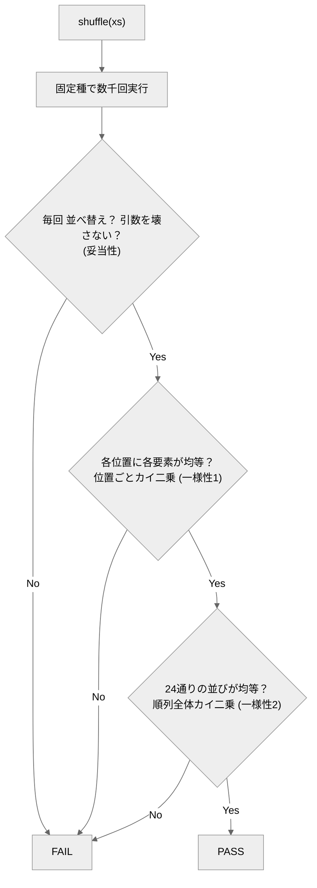

# monte-carlo-shuffle-agent

*A dependency-free demo of a Monte Carlo test oracle: a list-shuffling agent graded not by exact output,
but by chi-square statistics (per-position and whole-permutation uniformity) over thousands of seeded runs.*

リストを**ランダムに並べ替える**エージェントと、**出力が毎回変わる非決定処理を「多数回実行した統計」で判定する**オラクル（採点プログラム）。

専門用語を使わない説明は [説明書.md](説明書.md) にあります。

## 概要

シャッフルのように**正解が1つに決まらない**（毎回違ってよい）処理は、出力一致では測れません。
このリポジトリは、正しさを **多数回実行した統計的性質**で確かめる **モンテカルロ・オラクル** の実例です。

判定は妥当性＋2段のカイ二乗検定：
(1) 毎回ちゃんと並べ替えになっているか（妥当性。引数を壊さない・重複／空／長さ1でも要素が保存される）、
(2) 各位置に各要素が均等に来るか（一様性・位置ごと周辺分布）、
(3) 並びそのものが 4!=24 通りに均等に散らばるか（一様性・順列全体。位置ごとだけ均等な「巡回シフト」型を塞ぐ）。
種を固定するので結果は再現可能。

## クイックスタート

必要なもの：Python 3 のみ。**リポジトリのルートで実行**。

```bash
python eval/oracle.py            # 正しいシャッフル(reference)を採点 → PASS
python eval/oracle.py --selftest # オラクル自身を検証（②でFAILが出るのが正常）
```

→ ①は採点表に `PASS`、②は最後に `## オラクル判定: PASS`。どちらも終了コード 0（②で壊れた実装に FAIL が出るのは正常）。
CI（GitHub Actions）でも push ごとに `--selftest` を実行しています。

## エージェントの動かし方

`.claude/agents/monte-carlo-shuffle-agent.md` の指示で `eval/corpus/candidate.py` に `shuffle(xs)` を実装し、`python eval/oracle.py --candidate candidate` で採点。candidate が無くても `reference` で全工程を再現できます。

## しくみ



## 合否（eval）
固定種で多数回実行し、(妥当性) 毎回が並べ替えで引数を破壊しない ＋ (一様性) 位置ごとカイ二乗 < 閾値 かつ 順列全体（4!=24通り）のカイ二乗 < 閾値。
閾値はカイ二乗分布の臨界値（位置: df=5、順列: df=23・α=0.001 の≈49.73）を根拠に設定（詳細は `eval/oracle.py` のコメント）。

## ファイル構成
- `.claude/agents/…md` … エージェント定義／`eval/oracle.py` … 統計オラクル（`--selftest` 内蔵）
- `eval/corpus/reference.py` … 正例／`broken_*.py` … 既知バグ（陰性対照。周辺分布検定だけではすり抜ける `broken_rotate.py` を含む）
- `design/design.md` … 設計の考え方／`説明書.md` … 専門用語を使わない説明
- `.github/workflows/ci.yml` … CI（selftest を自動実行）

---
自作 AI エージェント集（評価駆動開発の実証）の一つ。背景は [design/design.md](design/design.md)。
