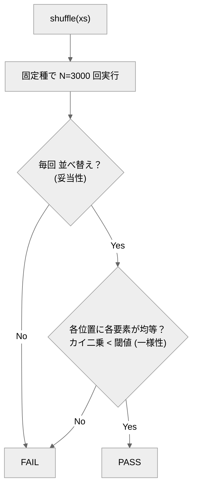

# monte-carlo-shuffle-agent

リストを**ランダムに並べ替える**エージェントと、**出力が毎回変わる非決定処理を「多数回実行した統計」で判定する**オラクル（採点プログラム）。

## これは何？

シャッフルのように**正解が1つに決まらない**（毎回違ってよい）処理は、出力一致では測れません。
このリポジトリは、正しさを **多数回実行した統計的性質**で確かめる **モンテカルロ・オラクル** の実例です。

判定は2点：(1) 毎回ちゃんと並べ替えになっているか（妥当性）、(2) 長い目で各位置に各要素が均等に来るか（一様性＝カイ二乗検定）。種を固定するので結果は再現可能。

## クイックスタート

必要なもの：Python 3 のみ。**リポジトリのルートで実行**。

```bash
python eval/oracle.py            # 正しいシャッフル(reference)を採点 → PASS
python eval/oracle.py --selftest # オラクル自身を検証（②でFAILが出るのが正常）
```

→ ①は採点表に `PASS`、②は最後に `## オラクル判定: PASS`。どちらも終了コード 0（②で壊れた実装に FAIL が出るのは正常）。

## エージェントの動かし方

`agent/monte-carlo-shuffle-agent.md` の指示で `candidate.py` に `shuffle(xs)` を実装し、`python eval/oracle.py --candidate candidate` で採点。candidate が無くても `reference` で全工程を再現できます。

## しくみ



## 合否（eval）
固定種で多数回実行し、(妥当性) 毎回が並べ替え ＋ (一様性) 位置ごとカイ二乗 < 閾値。

## ファイル構成
- `agent/…md` … エージェント定義／`eval/oracle.py` … 統計オラクル（`--selftest` 内蔵）
- `eval/corpus/reference.py` … 正例／`broken_*.py` … 既知バグ（陰性対照）
- `design/design.md` … 設計の考え方

---
自作 AI エージェント集（評価駆動開発の実証）の一つ。背景は [design/design.md](design/design.md)。
